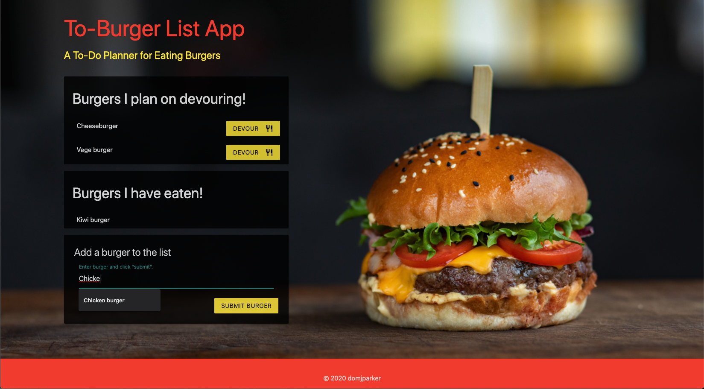

# To-Burger List App

## A simple app for making a burger to-do list, using MySQL, Node, Express, Handlebars, and custom ORM.  

  

## Table of Contents

* [Description](#description)
* [Installation](#installation)
* [Usage](#usage)
* [License](#license)
* [Contributing](#contribution)
* [Tests](#tests)
* [Questions](#questions)

## Description 

This application was really to experiment with writing a custom ORM, while also working with MySQL, Express, and Handlebars, among other things. Essentially, the user can input types of burgers they would like to eat, and these will be saved to the MySQL database via the model and custom-made ORM. The ORM was made to experiment with callback functions and because normally web developers use programs such as Sequelize that do it largely for you. This was an opportunity to do with the latter.    

## Installation

You can see a deployment of the application on [Heroku](http://google.com), but if you'd like to install it and see it operating from your local computer, clone the repo here in Github, and be sure to have or make an account with MySQL. From the command line, run 'npm start'.

## Usage 

This app is not really one that is designed to be 'used', but is moreso an experiment in custom ORM building and create/read/update functionality. However, to use it, simply input a type of burger. Then, to 'devour' that burger, click the 'devour button assocated with that burger. The burger will then appear in the 'Burgers I have already eaten' collection.   

## License

This application is covered under a [MIT License](https://opensource.org/licenses/MIT).

## Contributing

To contribute, create a pull request: 
* Fork the repo
* Create a feature branch (git checkout -b NAME-HERE)
* Commit new feature (git commit -m "Message about new feature")
* Push your branch (git push)
* Create new pull request

Your code will be reviewed and merged.

## Tests

No tests at this point. 

## Questions

Got questions? Feel free to contact me.  
Github username: [domjparker](https://github.com/domjparker)  

---

© 2020, Dominic Parker. All Rights Reserved.

